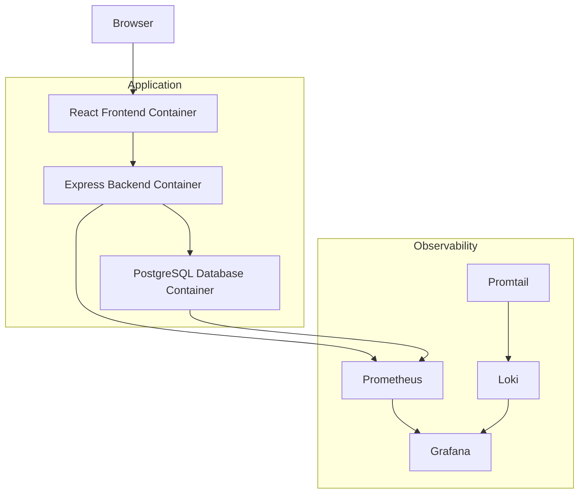

# Terraform 3-Tier Application with Docker & Full Observability

A **production-ready 3-tier web application (Task Manager)** deployed using **Terraform Infrastructure as Code** and **Docker containers**.

This project includes a **complete observability stack** with:

- Prometheus (Metrics)
- Grafana (Dashboards)
- Loki (Centralized Logging)
- Promtail (Log Shipping)

The entire infrastructure can be deployed with **a single Terraform command**.

---

# Features

- React.js Frontend
- Express.js Backend API
- PostgreSQL Database
- Fully containerized with Docker
- Infrastructure as Code using modular Terraform
- Built-in Prometheus metrics in backend
- Complete observability stack
- Auto-provisioned Grafana dashboards
- Remote Terraform state using MinIO (S3 compatible)
- One-command deployment

---

# Architecture

---

# Project Architecture

This project implements a **modern 3-tier application architecture** with full observability.

The architecture consists of the following layers:

### 1. Frontend Layer

- Built using **React.js**
- Runs inside a **Docker container**
- Communicates with the backend via REST API
- Accessible through port **3000**

Responsibilities:

- User interface
- Task management interactions
- API communication

---

### 2. Backend Layer

- Built using **Node.js Express**
- Runs inside a **Docker container**
- Exposes REST API endpoints
- Integrated with **Prometheus metrics**

Responsibilities:

- Business logic
- API management
- Metrics exposure
- Database communication

---

### 3. Database Layer

- **PostgreSQL database**
- Runs in its own **Docker container**
- Stores application task data

Responsibilities:

- Persistent storage
- Query optimization
- Data consistency

---

### 4. Observability Layer

This project includes a **complete monitoring and logging stack**.

#### Prometheus

- Collects metrics from:
  - Backend application
  - PostgreSQL
  - Node Exporter
  - cAdvisor

#### Grafana

Provides visualization dashboards for:

- Infrastructure metrics
- Container metrics
- Database metrics
- Application metrics

#### Loki

- Log aggregation system
- Stores logs generated by containers

#### Promtail

- Collects logs from containers
- Sends them to Loki

---

### 5. Infrastructure Provisioning

Infrastructure is provisioned using **Terraform modules**.

Modules used:

- Network module
- Frontend module
- Backend module
- PostgreSQL module
- Observability module

Terraform manages:

- Docker container deployment
- Monitoring stack provisioning
- Networking configuration
- Dashboard provisioning

---

### 6. Remote State Management

Terraform state can optionally be stored in **MinIO (S3 compatible)**.

Benefits:

- Team collaboration
- State locking
- Versioning
- Backup

---

### Architecture Flow

1. User accesses the **React frontend**
2. Frontend sends API requests to **Express backend**
3. Backend interacts with **PostgreSQL**
4. Backend exposes metrics to **Prometheus**
5. Prometheus metrics are visualized in **Grafana**
6. Logs are collected by **Promtail**
7. Promtail sends logs to **Loki**
8. Logs are visualized in **Grafana**

---

# Tech Stack

| Layer | Technology |
|------|------------|
| Frontend | React.js |
| Backend | Node.js + Express |
| Database | PostgreSQL |
| Containerization | Docker |
| Infrastructure | Terraform |
| Monitoring | Prometheus |
| Visualization | Grafana |
| Logging | Loki + Promtail |
| Remote State | MinIO |

