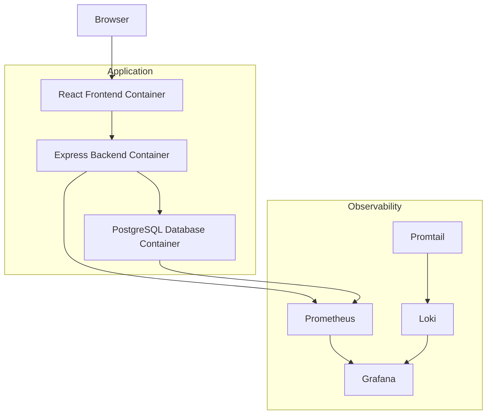

# Terraform 3-Tier Application with Docker & Full Observability

A **production-ready 3-tier web application (Task Manager)** deployed using **Terraform Infrastructure as Code** and **Docker containers**.

This project includes a **complete observability stack** with:

- Prometheus (Metrics)
- Grafana (Dashboards)
- Loki (Centralized Logging)
- Promtail (Log Shipping)

The entire infrastructure can be deployed with **a single Terraform command**.

---

# Features

- React.js Frontend
- Express.js Backend API
- PostgreSQL Database
- Fully containerized with Docker
- Infrastructure as Code using modular Terraform
- Built-in Prometheus metrics in backend
- Complete observability stack
- Auto-provisioned Grafana dashboards
- Remote Terraform state using MinIO (S3 compatible)
- One-command deployment

---

# Architecture

---

# Project Structure

terraform-3tier/

app/
├── backend/
│   ├── Dockerfile
│   ├── package.json
│   └── server.js
│
└── frontend/
    ├── Dockerfile
    ├── package.json
    ├── public/index.html
    └── src/
        ├── App.js
        └── index.js

monitoring/
├── prometheus.yml
├── loki-config.yml
├── promtail-config.yml
├── grafana-data/
└── loki-data/

terraform/
├── provider.tf
├── variables.tf
├── main.tf
├── backend.tf
├── outputs.tf
├── grafana_datasource.tf
├── grafana_dashboards.tf
├── grafana_wait.tf

modules/
├── network/
│   └── main.tf
├── postgres/
│   └── main.tf
├── backend/
│   └── main.tf
├── frontend/
│   └── main.tf
└── observability/
    └── main.tf

--- 

# Quick Start

1 Prerequisites

Recommended system:

Ubuntu 22.04

4GB RAM

2 CPU cores

Docker

Terraform 1.6.6+

--- 

# Install Docker

sudo apt update
sudo apt install docker.io -y

sudo systemctl start docker
sudo systemctl enable docker

sudo usermod -aG docker $USER

logout and login 

---

# Install Terraform

sudo apt install wget unzip -y

wget https://releases.hashicorp.com/terraform/1.6.6/terraform_1.6.6_linux_amd64.zip

unzip terraform_1.6.6_linux_amd64.zip

sudo mv terraform /usr/local/bin/

terraform -version

--- 

# Clone Repository

git clone https://github.com/amjmaxserve/terraform-docker-application-deployment-.git

cd terraform-docker-application-deployment-/terraform-3tier/terraform

---

# Deploy Infrastructure

Initialize Terraform

terraform init

Validate configuration

terraform validate

Check execution plan

terraform plan

Deploy everything

terraform apply -auto-approve

---

# Access the Application

Service	URL	Credentials

Task Manager	http://YOUR_IP:3000	-
Grafana	http://YOUR_IP:3001	admin / admin
Prometheus	http://YOUR_IP:9090	-
Backend API	http://YOUR_IP:5000/tasks

---

# Terraform Commands

terraform init
terraform validate
terraform plan
terraform apply
terraform destroy

---

# Monitoring & Observability

Prometheus collects metrics from:

Backend application metrics

Node Exporter

cAdvisor

PostgreSQL Exporter

---

# Grafana Dashboards

Auto-provisioned dashboards:

Node Exporter Overview

Docker Containers Monitoring

PostgreSQL Metrics

---

# Logging Stack

Tool	Purpose
Loki	Log aggregation
Promtail	Log shipping
Grafana	Log visualization

# Optional: Remote Terraform State using MinIO

Run MinIO:

docker run -d \
-p 9000:9000 \
-p 9001:9001 \
-e MINIO_ROOT_USER=admin \
-e MINIO_ROOT_PASSWORD=password \
--name minio \
minio/minio server /data --console-address ":9001"

Access console:

http://YOUR_IP:9001

---
# Contributing

1 Fork the repository

2 Create feature branch

git checkout -b feature/new-feature

3 Commit changes

git commit -m "Add new feature"

4 Push branch

git push origin feature/new-feature

5 Create Pull Request

---

License

Distributed under the MIT License.

See LICENSE for details.

---

Author

Arjun M J

DevOps Engineer | Cloud Architect | Cyber Forensics Analyst

GitHub Repository

https://github.com/amjmaxserve/terraform-docker-application-deployment-

---
